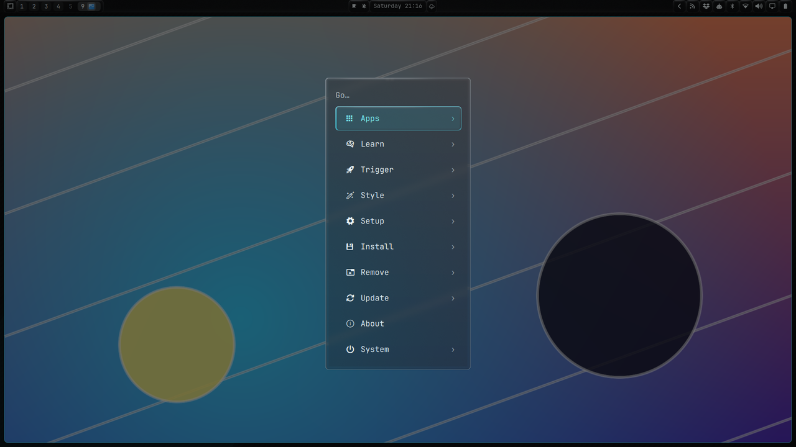
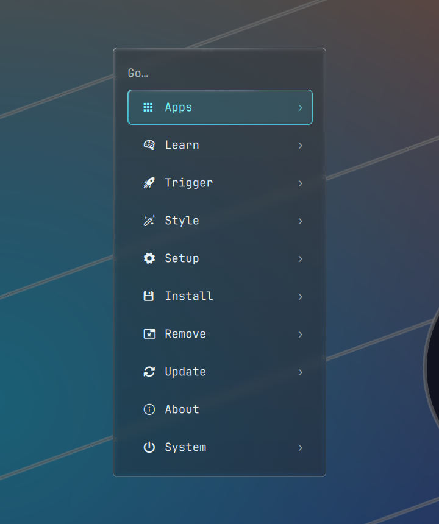
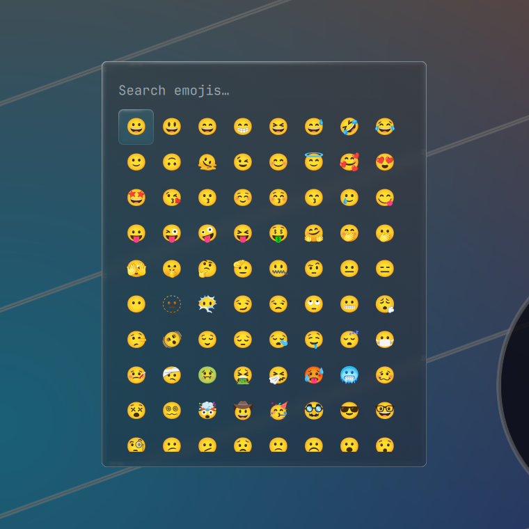
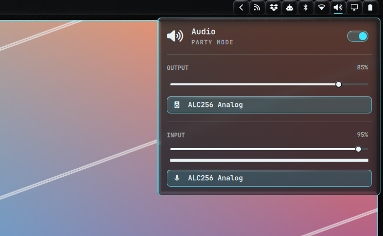
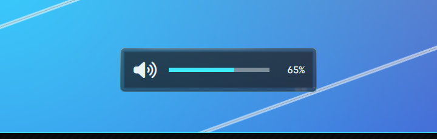
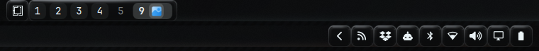

# Widget on Glass

Widget on Glass puts a translucent glass material on the Omarchy shell.
Hyprland blurs the desktop behind each surface. A shader paints the surface's
own theme colour on top at 75% opacity and adds a thin rim light. A
screen-space lens then bends real desktop pixels across each surface's edge.
Text and icons keep their colours.



**Status:** a pilot inspired by Apple's Liquid Glass, not a reproduction of it.
The area behind the centre of a surface is blurred, not refracted; only a narrow
band at each edge refracts. Built and tested against Omarchy `4.0.4`, Hyprland
`0.56.2` and Quickshell `0.3.1`. Other versions may need changes to the adapter.

## Two ways to use it

| | Marketplace plugin | Full installer |
|---|---|---|
| Surfaces | Bar and menu | Bar, panels, menu, clipboard, emojis, popups, notifications, OSD and their inner rows, chips and buttons |
| How | `omarchy plugin add` | Patches a checkout of the Omarchy source and links the system to it |
| Needs `sudo` | No | Yes, once, for `omarchy dev link` |
| Undo | `omarchy plugin remove` | `omarchy dev unlink` |

A third-party plugin can replace the bar and the menu, but it cannot restyle
panels, notifications or the OSD, which belong to the shell. The full installer
covers those.

## Gallery

| Menu | Emojis |
|---|---|
|  |  |

| Audio panel | Volume OSD |
|---|---|
|  |  |

Bar modules, left and right:



Look at the white diagonal lines where they cross a card's edge: the lens bends
them there.

## Install the plugin

The plugin lives in its own repository,
[omarchy-glass](https://github.com/KitsuneForgering/omarchy-glass):

```sh
omarchy plugin add https://github.com/KitsuneForgering/omarchy-glass.git --enable
```

Enabling it makes the glass bar the active bar. Its README explains how to point
the menu button and the menu keys at the glass menu. The plugin is generated
from the Omarchy sources by `integrations/marketplace/build.py` in this
repository.

## Install on every surface

In an Omarchy session, with `git`, `python3` and Qt Shader Tools
(`/usr/lib/qt6/bin/qsb`) available:

```sh
git clone https://github.com/KitsuneForgering/Widget-on-glass.git
cd Widget-on-glass
./install.sh
```

The installer:

1. Reads the installed Omarchy package version.
2. Clones the matching tag of the official source into
   `~/.local/share/widget-on-glass/`.
3. Applies the adapter.
4. Runs `omarchy dev link --no-reboot`, which uses `sudo` to point the system at
   the checkout.
5. Reloads the shell in the current Hyprland session.

The reload sets `OMARCHY_PATH` in both Hyprland and the user service manager
before `omarchy restart shell`, so your keybindings keep working. Reboot later
to move the remaining session services to the checkout.

To prepare and review the checkout without touching the running system:

```sh
./install.sh --prepare-only
```

Run `./install.sh` again from a terminal when you are ready; it reuses the
prepared checkout and asks for the `sudo` password. If the checkout is already
linked and you only want to reload the shell, without `sudo`:

```sh
./install.sh --reload-only
```

The installer refuses to overwrite a directory that is not a prepared checkout,
and it stops if the Omarchy source changed at any point the adapter edits. Do
not activate a partly prepared checkout.

If the local `tornikegomareli.spaces` plugin is installed, the reload also makes
its preview background transparent so the shared `PopupCard` glass shows
through, and keeps the original as `Spaces.qml.widget-on-glass.bak`.
Third-party panels built on `KeyboardPanel` or `PopupCard` get the material
through those shared components. Opaque backgrounds drawn inside other plugins
still need their own changes.

### Go back to the packaged shell

```sh
omarchy dev unlink --no-reboot
```

Reboot afterwards. The checkout stays in `~/.local/share/widget-on-glass/` for
inspection; unlinking does not delete it.

## Settings

Both the plugin and the installer read these keys from the `bar` object in
`~/.config/omarchy/shell.json`:

| Key | Effect |
|---|---|
| `glassEnabled: false` | Opaque bar and keyboard panels, no blur and no lens |
| `glassLens: false` | Keep the glass, turn off the rim lens |
| `glassReducedTransparency: true` | Opaque bar and keyboard panels, no lens |
| `glassHighContrast: true` | Opaque bar and keyboard panels, no lens |

The lens picks up changes to this file immediately.

## What the installer changes

- **Blur:** real desktop blur, limited to each host's region with
  `BackgroundEffect.blurRegion`.
- **Rim lens:** one generated Hyprland `screen_shader` follows the position and
  size of every visible glass surface. It never replaces a shader you
  configured, turns off with more than one monitor, steps aside for fullscreen
  windows and returns after `hyprctl reload`.
- **Inner containers:** selected rows, device chips and filled buttons get a rim
  light and the lens through the shared `BorderSurface`; dropdown popups and the
  confirmation dialog use the full material.
- **Launcher veil:** the veil around the menu, clipboard and emoji cards leaves a
  hole under the card, so the glass shows the blurred desktop instead of a
  darkened one.
- **Tray drawer:** the drawer only takes the space it has revealed instead of
  reserving its full width.
- **Contrast:** menu and clipboard secondary text is drawn fully opaque, so it
  stays above 4.5:1 over any backdrop at 75% opacity. Dimmed labels drawn by
  stock panel widgets can fall below that over very bright backdrops.
- **Software rendering:** an opaque fallback is used when Qt renders without a
  GPU.

Alternative bars, plugins that create their own windows, the image picker and
the lock screen keep their original look.

## More

- [Implementation and validation](Docs/implementation.md): what is covered and
  how it was tested, including the standalone Quickshell demo.
- [Desktop refraction research](Docs/compositor-refraction.md): why full-area
  refraction needs changes to Hyprland's renderer, and how the rim lens was
  measured.
