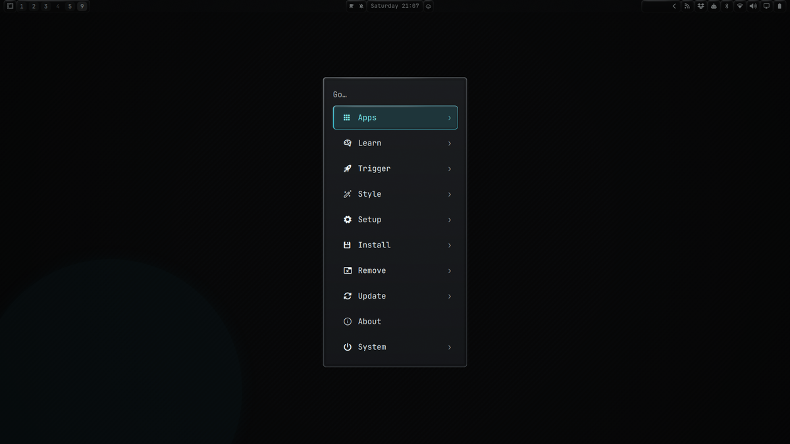

# Omarchy Glass

A translucent glass bar and menu for the Omarchy shell. Hyprland blurs the
desktop behind each surface, a shader paints the theme's own surface colour on
top with a thin rim light, and a screen-space lens refracts real desktop pixels
across every rim. Text and icons keep their colours.



## What it changes

The plugin provides three pieces:

- **Bar** (`kind: bar`): the Omarchy bar with glass modules. It renders the same
  widgets and layout as the built-in bar.
- **Menu** (`kind: menu`): the Omarchy menu on a glass card. Rows and the
  selection keep their behaviour; the veil around the card no longer darkens it.
- **Menu button** (`kind: bar-widget`): a bar button that opens the glass menu.

Panels opened by bar widgets (audio, Bluetooth, network…), notifications, OSD,
clipboard and emojis belong to the shell and keep the stock look. A plugin
cannot restyle them.

## Install

Requires Omarchy 4.0.4 or newer with Hyprland.

```sh
omarchy plugin add https://github.com/KitsuneForgering/omarchy-glass.git --enable
```

Enabling it makes Glass the active bar. To open the glass menu from the bar,
replace the `omarchy.menu` entry in your bar layout with
`kitsuneforgering.glass`. To open it from the keyboard, rebind the menu keys in
`~/.config/hypr/bindings.lua`:

```lua
hl.unbind('SUPER + SPACE')
o.bind("SUPER + SPACE", "Glass menu",
  [[omarchy-shell shell toggle kitsuneforgering.glass '{"menu":"root"}']])
```

Any route of `omarchy menu` works the same way, for example
`'{"menu":"apps"}'`.

## Settings

The bar reads these keys from the `bar` object in `~/.config/omarchy/shell.json`:

| Key | Effect |
|---|---|
| `glassEnabled: false` | Opaque bar, no blur and no lens |
| `glassLens: false` | Keep the glass, turn off the rim lens |
| `glassReducedTransparency: true` | Opaque surfaces and no lens |
| `glassHighContrast: true` | Opaque surfaces and no lens |

The bar and the menu use 75% surface opacity. Bar text and menu labels and
details are drawn fully opaque and stay above 4.5:1 contrast over any
backdrop; the search placeholder and the row chevrons stay dimmer.

## The rim lens

The lens is a Hyprland `decoration:screen_shader` generated from the positions
of the visible glass surfaces. It only bends a narrow band at each edge; the
area behind the centre of a surface is blurred, not refracted. The lens:

- never replaces a `screen_shader` you configured yourself;
- runs on a single unrotated monitor and turns off with more than one;
- steps aside while a window is fullscreen;
- comes back after `hyprctl reload` and is cleared when the plugin unloads.

It writes the generated shader to `$XDG_RUNTIME_DIR/omarchy-glass-lens-*.frag`
and calls `hyprctl`. It needs no network access, no `sudo` and no extra
packages.

## Remove

```sh
omarchy plugin remove kitsuneforgering.glass
```

The shell falls back to the built-in bar. If you rebound the menu keys, restore
them to `omarchy-menu toggle`.

## How it is built

`Bar.qml`, `Menu.qml`, `MenuButton.qml`, `BarModel.js` and `MenuModel.js` are
generated from the Omarchy shell sources by
[Widget on Glass](https://github.com/KitsuneForgering/Widget-on-glass)
(`integrations/marketplace/build.py`), which applies the same tested glass
patches as its full-shell installer. Edit the generator rather than these files.
The full installer is the way to put glass on every shell surface.

This is an approximation inspired by Apple's Liquid Glass, not a reproduction of
it.

## License

MIT. The generated files are derived from Omarchy, © David Heinemeier Hansson,
also under the MIT license. See [LICENSE](LICENSE).
